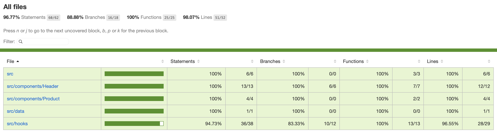

# Storefront

A small product browsing and shopping cart app built with React, TypeScript, and Vite.

## Quickstart

Install dependencies:

```bash
npm install
```

Start the dev server:

```bash
npm run dev
```

The app will be available at `http://localhost:5173`.

## Scripts

| Command | Description |
|---|---|
| `npm run dev` | Start the app in a local dev server |
| `npm test` | Run the test suite once |
| `npm run test:watch` | Run tests in watch mode |
| `npm run test:coverage` | Run tests and generate a coverage report |
| `npm run lint` | Run ESLint across the project |

Coverage output is written to `coverage/` — open `coverage/index.html` for the full HTML report.



## Project structure

```
src/
  components/
    Header/       — app header, cart button, and cart modal table
    Product/      — product list card with price and basket controls
  data/
    products.ts   — static product data, related ttypes
  hooks/
    useCart.tsx   — packages cart state, localStorage persistence, exposes 'augmented' product data
  styles/
    global.scss   — CSS custom properties (design tokens), reset, base styles
  utils.ts        — formatPrice (simple currency formatter)
  App.tsx
  main.tsx
```

## Notes

- Running the product data and the state through the useCart hook works nicely and reads well for a very small consistent data set as in the requirements – I don’t think it would scale very well as is
- Persistence doesn’t have a lot of validation against data changes etc, although the way state is modified should be fairly resistant against the data changing since it’s tied to unique ids
- I used Claude Code for a few tasks, mostly scaffolding the app and putting in some basic styling for me to work with later – I’ve kept a clean divide between commits which have LLM-generated content (marked with a 🤖) and I’ve recorded the prompts I gave the LLM below so you can see the scope:

### LLM usage

❯ Create a new vite / react / typescript app in this folder, with sensible eslint rules and minimal boilerplate. Set up a basic main view for an app called 'Storefront', with a header featuring the app title in an uppercase geometric sans, using css-modules and scss for the styling. Set up vitest and react-testing library and add a smoke test for the empty application.

❯ Style the product list in the main view as blocks in a two column layout, encapsulating styles for the Product component as appropriate. 

❯ The columns feel a bit wide – put a consistent max width on the header / main content to give some space around the content. Also the colours are boring and the fonts feel small, I want this to feel bold and visually appealing 

❯ Set up ts aliases for key folders (data, styles, components) and update imports

❯ Add a shopping cart icon to the cartButton dropdown – when `cartOpen` is true the cart icon should be replaced by a cross. They should be in keeping with the styles I have added.  
